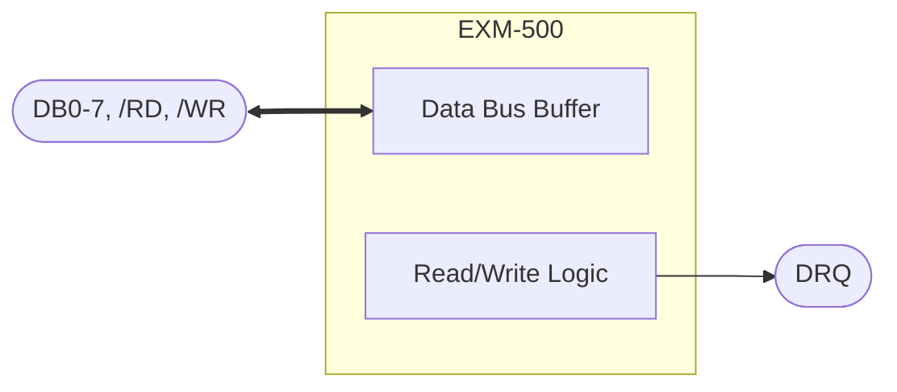

# Representation Guide

How to express each kind of technical content as text. The goal is that a reader who never sees the original can recover every value, connection and relationship, and can tell what was printed from what was added.

## Contents

1. Document header and conventions
2. Prose, notes and page furniture
3. Tables
4. Bit fields, register and memory maps
5. Pinouts and packages
6. Block diagrams and system diagrams
7. Logic diagrams and schematics
8. Timing diagrams (waveforms)
9. State machines, flowcharts, sequences
10. Dot matrices, pixel grids, screen layouts
11. Plots and characteristic curves
12. Mechanical and package drawings
13. Photographs and other genuine pictures
14. Equations and code
15. Marking additions: Transcriber's notes, derived and inferred values

---

## 1. Document header and conventions

Start every transcription with:

```markdown
# <Document title as printed>

> Transcribed from <publisher> *<full title>*, document <number>, revision <rev>, pages <range>.
> <"The scan has no text layer, so every paragraph, table and figure was transcribed from the page images." if true>
>
> <Page furniture summary: running header, footer, document number on every page, "(Continued)" headings not repeated.>

**Conventions used in this transcription**

- <signal naming, e.g. active-low signals written with a leading slash: `/RD`>
- <subscripts written inline: `LC0-3`, `A0`>
- <Block diagrams are Mermaid flowcharts, each followed by a plain-text connection list.>
- <Timing diagrams are ASCII waveforms. The legend is below.>
- <Dot-matrix pictures use `█` for a lit dot and `·` for a dark dot.>
- Paragraphs marked **Transcriber's note** are not part of the original. They flag inconsistencies found in the source or explain derived values.
```

Include only the conventions the document needs. Keep the list lines stable: split parts copy them verbatim.

## 2. Prose, notes and page furniture

- Keep sentences as printed, including odd phrasing and gendered or dated language. Fix nothing silently; a clear typo can be corrected with a Transcriber's note that quotes the original.
- Keep every "Note:", footnote, asterisk and "NOTICE" block where it appears.
- Keep original heading numbering. Use Markdown heading levels consistently (`##` chapter, `###` section, `####` figure/table/sub-section).
- Cross-references like "(See Programming Section.)" stay as printed; they can become links later without changing the visible words.
- Put `<!-- page X -->` before each original page's content. Describe running headers/footers once in the source statement instead of repeating them.

## 3. Tables

- One Markdown table per printed table, with the printed title as a heading (`### Table 1. Pin Descriptions`).
- **Multi-row headers:** merge into one header row with combined labels (`Min.`, `Max.`, `Units`), or name the group in the header (`Outputs LA1 LA0 VSP LTEN`).
- **Merged cells:** repeat the value in each row when rows are independent facts; when one cell spans sub-rows (a code with three sub-rows), either keep the value in every row or collapse the sub-rows into one row with compact columns (`Above: 0 0 1 0`). Explain the compact format in one sentence above the table.
- **Grouped rows** (LC3..LC0 on pins 1..4): one row with comma-separated symbols and pins in matching order.
- **Multi-line cells:** join with `<br>` or with `—` bullets inside the cell.
- **Ellipsis rows** (`⋮`) stay as printed; add the general rule as a derived note if it is obvious (value + 1).
- **Bit patterns** keep the printed spacing (`0 0 1 S S S B B`); add a hex column marked `(hex, derived)` when useful.
- Never drop units or test conditions. Blank cells stay blank.

## 4. Bit fields, register and memory maps

Bit layout as a table with explicit positions:

```markdown
| Bit | 7 (MSB) | 6 | 5 | 4 | 3 | 2 | 1 | 0 (LSB) |
|---|---|---|---|---|---|---|---|---|
| Value | 1 | 0 | U | R | G | G | B | H |
```

Follow with a bullet per field (`- **U = 1** for underline`). Register maps: `| Address | Name | Access | Reset | Bits / description |`. Memory maps: `| Start | End | Size | Region | Notes |`. Keep hex/binary notation as printed; add conversions only as marked derived columns.

## 5. Pinouts and packages

- Pin table: `| Pin | Symbol | Type | Function |` in pin order, or the printed table layout if it differs.
- DIP/SOIC pinout drawing: an ASCII package in a ```text block with pin numbers on both sides, notch at the top.
- BGA/QFP: a table (ball or pin number → signal); for BGA also a row/column grid in a text block if the document shows one.

## 6. Block diagrams and system diagrams

Mermaid flowchart plus a connection list:



Rules that avoid the errors seen in practice:

- **Draw what is printed.** Keep every arrow direction as drawn, including ones that look wrong; explain in a Transcriber's note. Include thin control arrows as well as wide bus arrows (`==>` for wide/bus, `-->` for single-line, `<==>`/`<-->` only when both heads are drawn). Draw duplicate arrows when the figure has two.
- **Trace lines to their real end.** A line that passes *beside* a block is not connected to it; zoom in to see where arrowheads land.
- **Node IDs:** short alphanumeric IDs; put all visible text in quoted labels (`N1["Row Buffers (2) 80 x 8"]`). Avoid `end`, `graph`, `subgraph`, `style`, `class`, `click` as IDs. Use `<br/>` for line breaks.
- **External pins** as stadium nodes `(["..."])`; the chip boundary as a `subgraph`.
- **Connection list** after the diagram: one bullet per block or signal group, stating sources, destinations and directions in words. It is the authoritative text version; the Mermaid is the picture.
- **Figures that repeat a base figure** with highlights: reference the base (`Figure 3 repeats Figure 1`) and describe the highlighted path in a table.
- Validate with `scripts/check_mermaid.mjs`.

## 7. Logic diagrams and schematics

- **Gate-level logic:** Mermaid flowchart with gate nodes (`["NOR gate<br/>CHAR. GEN. ENABLE"]`) plus a circuit description list plus **logic equations marked derived**:
  ```text
  CHAR_GEN_ENABLE = NOT (LA1 OR LA0)
  VIDEO           = (SR_OUT AND NOT VSP_sync) OR LTEN_sync
  ```
  Record which inputs each gate receives exactly (for example "OR gates 0-3 receive HORIZ. RIGHT HALF"). Check gate symbols (AND/NAND/OR/NOR, bubbles) at high zoom.
- **Analog/board schematics:** a component table (`| Ref | Value | Part | Notes |`), a net list (`| Net | Connected pins |`), and a short functional description per circuit block. Mermaid only for the block level. Keep reference designators exactly.
- **Unlabelled arrows** stay unlabelled; if you infer the signal, mark it as inferred.

## 8. Timing diagrams (waveforms)

Generate with `scripts/wavegen.py` from a JSON spec; never hand-align long diagrams.

Legend to include once in the header:

```text
Waveform legend
  ‾‾‾‾   signal high            ____   signal low
  \  /   falling / rising edge  X      bus or state change
  ====   bus valid / state      ~~~~   high impedance (float)
  //     time break (not to scale)
  ////   slow rising edge       \\\\   slow falling edge (rise / fall time)
  |<-tXX->|   timing parameter between the marked edges
```

Rules:

- Keep the printed signal order and names.
- **Segment labels only where printed.** Unlabelled bus segments stay unlabelled (use `X`/`=` tokens); do not invent "line 0", "prev", "disp 2".
- Keep brace texts verbatim, including qualifiers ("programmable from 1 to 16 lines").
- Put each timing parameter marker between the same two edges as the original. Check which edge (rising or falling) a parameter ends on at high zoom — this was the most serious error in the reference conversion.
- After each diagram, a table: `| Parameter | Measured from | To |`. Describe causal arrows of the original in one sentence each.
- Waveforms are not to scale; say so once.

### wavegen spec format (summary)

Slot mode (`"w"` = characters per time slot):

- `"H"`/`"L"` level, edge drawn at the slot start; `"C"` one clock period; `"B:text"` bus value (label centred when it fits); `"X"` unlabelled bus change; `"Z"` high impedance; `"="` continue the previous state; `"//"` time break (same slot in every row); `"T*n"` repeats token T n times.
- Marker rows (`["", "mark", tokens]`): `"A:text"` starts a span, `"a"` continues it, `"-"` is empty; the span closes at the next non-`a` slot.

Raw mode (`"raw": <columns>`): `["SIG", "lvl", "H", [[c0, c1, "r"|"f"], ...]]`, `["BUS", "bus", [[col, "text"|"Z"|""], ...]]`, `["", "mark", [[c0, c1, "text"], ...]]`. Use raw mode when edges of different signals fall at arbitrary relative positions (DMA handshakes, setup/hold).

Full details are in the `scripts/wavegen.py` docstring.

## 9. State machines, flowcharts, sequences

- State diagrams: `stateDiagram-v2` with transition labels as printed (`IDLE --> RUN : START=1`), plus a transition table.
- Flowcharts: `flowchart TD` with decision nodes `{"..."}`; keep yes/no branch labels.
- Protocol exchanges: `sequenceDiagram` with messages as printed, plus a message table (direction, name, fields, timing).

## 10. Dot matrices, pixel grids, screen layouts

- Dot grids in ```text blocks with `█` (lit) and `·` (dark), one text line per printed line, cells separated by a space when the figure separates characters.
- Measure with `scripts/dot_grid.py`; read the figure visually as a second check. Note when printed cell boundaries (braces) and dot counts disagree.
- Grids that pair dots with values (line counters) become tables with a dots column in inline code.
- Screen layouts: box-drawing frame (`╭─╮│╰╯`) sized to the content, one text line per screen row; mark underlines on a following line with `‾`. Count blank rows exactly. Explain the notation in one sentence.

## 11. Plots and characteristic curves

- State axes (quantity, unit, scale linear/log, range) and each curve's condition (temperature, supply).
- Table of key points read from the plot, marked approximate (`≈`), with the reading resolution.
- One or two sentences on the trend (monotonic, knee, saturation). Never present read-off values as specifications.

## 12. Mechanical and package drawings

- Dimension table: `| Symbol | Min | Nom | Max | Unit | Notes |`, both unit systems if printed.
- Optional ASCII outline for orientation (pin 1 marker, top view).
- Keep drawing notes and tolerances verbatim.

## 13. Photographs and other genuine pictures

Only when the content cannot be expressed as text (photos of boards, product shots, artwork, micrographs):

- Crop tightly with `scripts/crop.py` at a resolution that keeps detail (300 DPI is usually enough).
- Save as `<output-name>-assets/figure-<n>.png` next to the Markdown.
- Embed with a description: `` and one or two sentences of useful detail (labels visible, what the reader should notice).
- Transcribe any legible labels, callouts or tables inside the picture as text as well.

## 14. Equations and code

- Equations: plain text in a ```text block (`f = 1 / (2π · R · C)`), or `$...$` LaTeX only when the user's viewer renders it. Define symbols as printed.
- Code listings: fenced block with language; keep line numbers only when the text refers to them.

## 15. Marking additions

- **Transcriber's note** (a blockquote starting `> **Transcriber's note:**`) for: contradictions inside the source, printed typos, drawing oddities you preserved, inferred readings, and anything you deliberately did not reproduce.
- **Derived** for values computed from printed data (hex, formulas, counts): say "derived" in the column header, the sentence, or the table caption.
- **Inferred** for interpretations the document does not state (0-based numbering, which signal an unlabelled arrow carries). Say what the inference rests on.
- Keep notes short and specific: what the original prints, why it is odd, what the reader should do.
